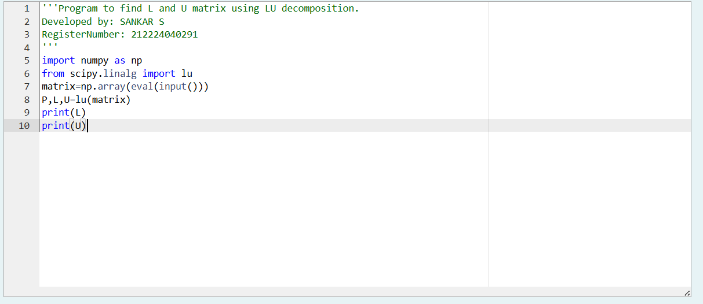
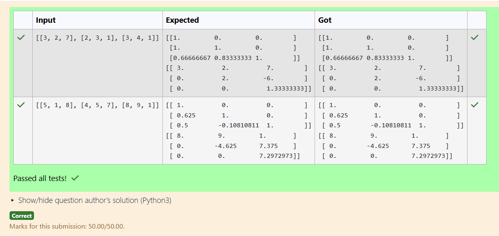
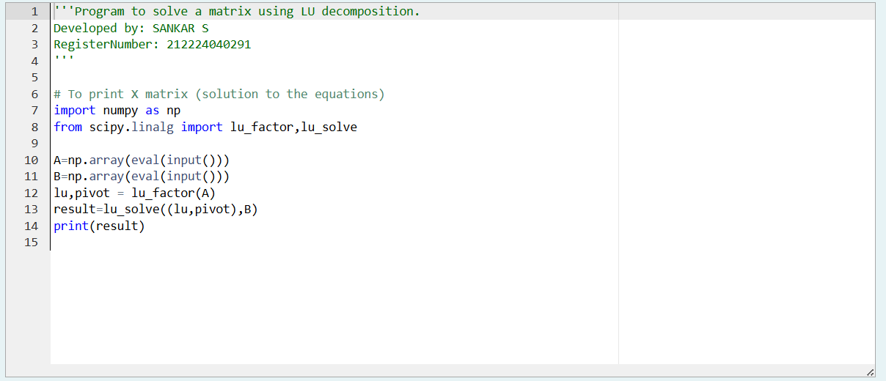
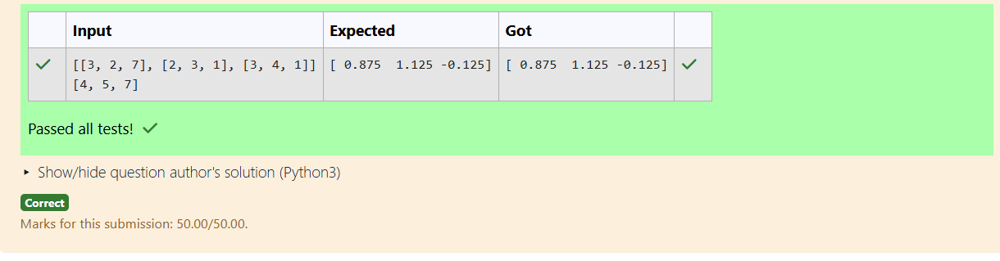

# LU Decomposition 
```
NAME: SANKAR S
DEPT: B.E/CSE
REG NO: 212224040291
```
## AIM:
To write a program to find the LU Decomposition of a matrix.

## Equipments Required:
1. Hardware – PCs
2. Anaconda – Python 3.7 Installation / Moodle-Code Runner

## Algorithm

Step 1. Start: Import the required libraries (`numpy` and `scipy.linalg`) and read the input matrix.

Step 2. Apply LU Decomposition: Use the function `lu(matrix)` to decompose the matrix into **P**, **L**, and **U** matrices.

Step 3. Store Results: The function returns permutation matrix **P**, lower triangular matrix **L**, and upper triangular matrix **U**.

Step 4. Display Output: Print the **L** and **U** matrices.


ii)


Step 1: Start: Import the required libraries (numpy and scipy.linalg) and input matrices A (coefficients) and B (constants).


Step 2: LU Factorization: Use lu_factor(A) to decompose matrix A into its L (lower) and U (upper) triangular matrices.


Step 3: Solve the System: Use lu_solve((lu, pivot), B) to find the solution vector X.


Step 4 : Display Result: Print the computed solution X.


## Program:
(i) To find the L and U matrix
```

import numpy as np
from scipy.linalg import lu
matrix=np.array(eval(input()))
P,L,U=lu(matrix)
print(L)
print(U)
```
(ii) To find the LU Decomposition of a matrix

```

import numpy as np
from scipy.linalg import lu_factor,lu_solve

A=np.array(eval(input()))
B=np.array(eval(input()))
lu,pivot = lu_factor(A)
result=lu_solve((lu,pivot),B)
print(result)


```
## Output:






## Result:
Thus the program to find the LU Decomposition of a matrix is written and verified using python programming.

